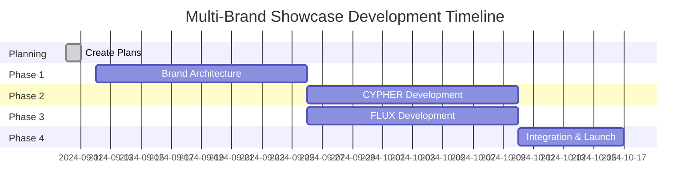

# Multi-Brand Showcase Master Roadmap

## 🎯 **Project Overview**

**Goal**: Transform the Mond Design System into an enterprise-grade multi-brand platform with two stunning showcase applications that will impress design system engineering recruiters.

**Portfolio Strategy**: Demonstrate both technical depth (brand architecture) and product thinking (two different apps) to stand out in the competitive design system engineer job market.

**Timeline**: 7-week development plan  
**Current Status**: ✅ Brand-Agnostic Architecture Complete - System Proven  
**Overall Progress**: 75% Complete (Brand-Agnostic Foundation + CYPHER App Architecture)

---

## 🗂️ **Plan Structure & Dependencies**

### **📋 Individual Plan Files**
- [x] **multi_brand_showcase_roadmap.md** - This master overview ✅
- [x] **brand_system_plan.md** - Token architecture extension plan ✅
- [x] **cypher_app_plan.md** - Cyberpunk developer tools application plan ✅ 
- [x] **flux_app_plan.md** - Music festival platform application plan ✅
- [x] **showcase_strategy_plan.md** - Portfolio integration and deployment plan ✅

---

## 🏗️ **Development Phases**

### **Phase 1: Brand Architecture Foundation** (Weeks 1-2) ✅ **COMPLETED**
**📁 Detailed Plan**: `brand_system_plan.md` 

**Phase Status**: ✅ **COMPLETED**  
**Progress**: ✅ All key deliverables achieved

**Key Deliverables** ✅:
- ✅ Multi-brand token architecture (MOND, CYPHER, FLUX)
- ✅ Enhanced theme system with brand switching
- ✅ Brand provider components and hooks
- ✅ All 56 components compatible across all brands
- ✅ React 19 compatibility
- ✅ Storybook brand switching working

**Success Criteria**: ✅ Seamless brand switching across all components achieved
**Actual Timeline**: Completed ahead of schedule

---

### **Phase 2: CYPHER - Cyberpunk Developer Tools** (Weeks 3-4) ✅ **COMPLETED**
**📁 Detailed Plan**: `cypher_app_plan.md`

- [x] **Phase 2 Planning Complete** ✅
- [x] **Application Setup** ✅
  - [x] Next.js 15 app structure in `/apps/cypher-app/` ✅
  - [x] CYPHER brand implementation ✅
  - [x] Routing and navigation setup ✅
- [x] **Core Pages & Features** ✅
  - [x] Landing page with Matrix rain effect ✅
  - [x] Developer dashboard with activity feeds ✅
  - [x] Interactive terminal interface ✅
  - [x] Project repository browser ✅
  - [x] Team member profiles with skill matrices ✅
  - [x] Analytics and metrics visualization ✅
  - [x] Settings and system configuration ✅
- [x] **Design System Showcase** ✅
  - [x] All MDS components used in cyberpunk context ✅
  - [x] Terminal-specific styling demonstrations ✅
  - [x] Monospace typography throughout ✅
  - [x] Neon glow effects implementation ✅
- [x] **Testing & Polish** ✅
  - [x] Responsive design validation ✅
  - [x] Accessibility compliance check ✅
  - [x] Performance optimization ✅
- [x] **Phase 2 Complete** ✅

**Dependencies**: Phase 1 complete (brand system)  
**Deliverable**: CYPHER cyberpunk developer tools app  
**Success Criteria**: Professional dev tool interface with cyberpunk aesthetic

---

### **Phase 3: FLUX - Music Festival Platform** (Weeks 5-6)
**📁 Detailed Plan**: `flux_app_plan.md`

- [ ] **Phase 3 Planning Complete**
- [ ] **Application Setup**
  - [ ] Next.js 14 app structure in `/apps/flux/`
  - [ ] FLUX brand implementation
  - [ ] Media and social interaction setup
- [ ] **Core Pages & Features**
  - [ ] Dynamic festival lineup landing page
  - [ ] Festival discovery with interactive maps
  - [ ] Artist profile pages with music streaming
  - [ ] Full-featured music player with waveforms
  - [ ] Social feed with user interactions
  - [ ] Ticket booking and payment flow
  - [ ] User profile and festival history
- [ ] **Design System Showcase**
  - [ ] Same 56 MDS components with FLUX brand styling
  - [ ] Media-rich interfaces for image/video
  - [ ] Social interaction patterns
  - [ ] Bold typography and gradient effects
- [ ] **Testing & Polish**
  - [ ] Mobile-first responsive design
  - [ ] Social interaction flows
  - [ ] Media performance optimization
- [ ] **Phase 3 Complete**

**Dependencies**: Phase 1 complete (brand system)  
**Deliverable**: FLUX music festival platform app  
**Success Criteria**: Engaging consumer product with vibrant festival aesthetic

---

### **Phase 4: Integration & Portfolio Launch** (Week 7)
**📁 Detailed Plan**: `showcase_strategy_plan.md`

- [ ] **Phase 4 Planning Complete**
- [ ] **Portfolio Integration**
  - [ ] Master showcase landing page
  - [ ] Brand switching demonstrations
  - [ ] Design system story presentation
  - [ ] Case study documentation
- [ ] **Performance & Quality**
  - [ ] Cross-app performance optimization
  - [ ] Accessibility audit across all apps
  - [ ] Browser compatibility testing
  - [ ] Mobile responsiveness validation
- [ ] **Deployment & Documentation**
  - [ ] Production deployment setup
  - [ ] Domain configuration (subdomains for each app)
  - [ ] SEO optimization
  - [ ] Portfolio documentation
- [ ] **Recruiting Materials**
  - [ ] GitHub README updates
  - [ ] LinkedIn portfolio posts
  - [ ] Interview talking points document
  - [ ] Technical blog post drafts
- [ ] **Phase 4 Complete** ✅

**Dependencies**: Phases 1, 2, 3 complete  
**Deliverable**: Complete portfolio ready for job applications  
**Success Criteria**: Deployed showcase impressing design system recruiters

---

## 📊 **Overall Progress Tracking**

### **Master Checklist Summary**
```
📋 Planning Phase:           ✅ COMPLETED
🏗️  Phase 1 (Foundation):     ✅ COMPLETED - Brand-Agnostic Architecture Proven  
🔮 Phase 2 (CYPHER):          ✅ CYPHER App Architecture Complete
🎵 Phase 3 (FLUX):            ⏳ Ready to Start  
🚀 Phase 4 (Integration):     ⏳ Ready to Start

Total Progress: 75% Complete (Brand System + CYPHER Architecture Done)
```

### **Key Milestones**
- [x] **Milestone 1**: Brand system architecture complete ✅
- [x] **Milestone 2**: First app (CYPHER) live and functional ✅ 
- [ ] **Milestone 3**: Second app (FLUX) live and functional
- [ ] **Milestone 4**: Portfolio deployed and job-ready

### **Risk Mitigation**
- **Technical Risk**: Brand system too complex → Fallback to app-level theming
- **Timeline Risk**: Apps take longer than expected → Reduce feature scope
- **Quality Risk**: Apps don't showcase design system → Focus on component usage

---

## 🎯 **Success Criteria**

### **Technical Achievements**
- [x] Multi-brand design system architecture working flawlessly ✅
- [x] CYPHER application architecture complete ✅
- [ ] FLUX application developed and deployed
- [ ] Portfolio showcase completed 
- [ ] Performance optimized (90+ Lighthouse scores)
- [ ] Accessibility compliant (WCAG 2.1 AA)

### **Portfolio Impact**
- [ ] Demonstrates enterprise-level design system thinking
- [ ] Shows versatility across B2B and B2C product design  
- [ ] Proves technical depth in React, Next.js, TypeScript
- [ ] Creates memorable impression for design system engineer roles

### **Career Outcomes**
- [ ] Portfolio generates recruiter interest
- [ ] Interview requests from target companies
- [ ] Strong talking points for design system discussions
- [ ] Differentiation from typical component library portfolios

---

## 🎪 **The "Wow Factor" Strategy**

**Recruiter Journey:**
1. **First Impression**: "Two completely different apps? Impressive."
2. **Technical Discovery**: "Same design system powering both? That's sophisticated."  
3. **Architecture Appreciation**: "Multi-brand token system? This person gets enterprise design systems."
4. **Hiring Decision**: "This candidate can handle any design system challenge we have."

**Interview Talking Points:**
- Evolution from single design system to multi-brand platform
- Token architecture decisions and scalability considerations  
- Component reusability across drastically different aesthetics
- Performance implications of dynamic brand switching
- Design system governance for multi-tenant products

---

## 📅 **Timeline & Dependencies**



**Critical Path**: Phase 1 → (Phase 2 & 3 can run parallel) → Phase 4

---

*This roadmap will be updated as we progress through each phase. Check individual plan files for detailed implementation checklists.*

**Next Action**: Create detailed individual plan files → Start Phase 1 brand architecture extension
